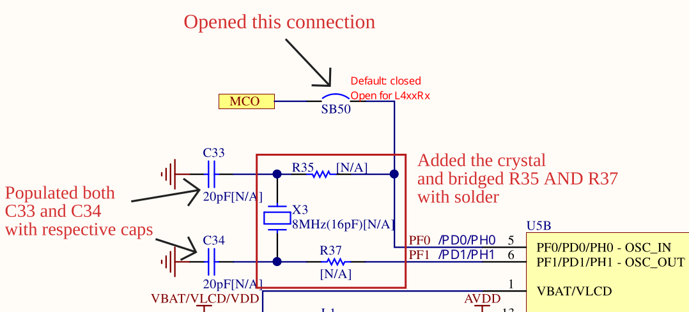
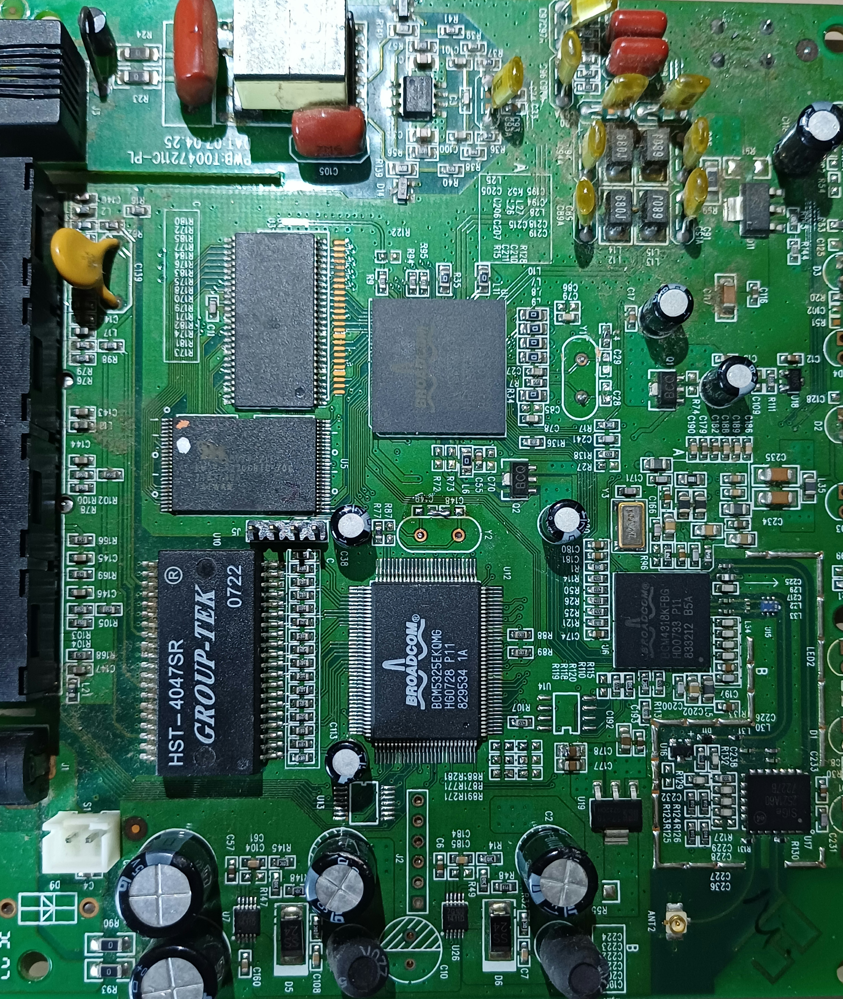
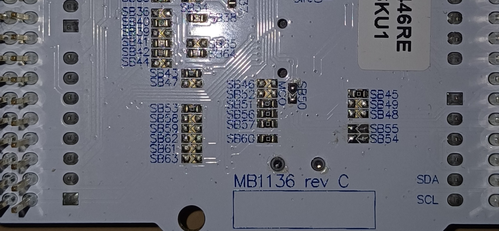
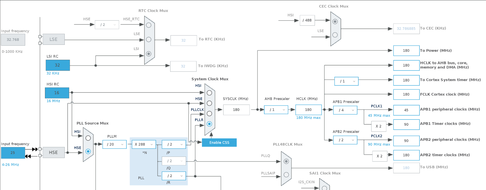
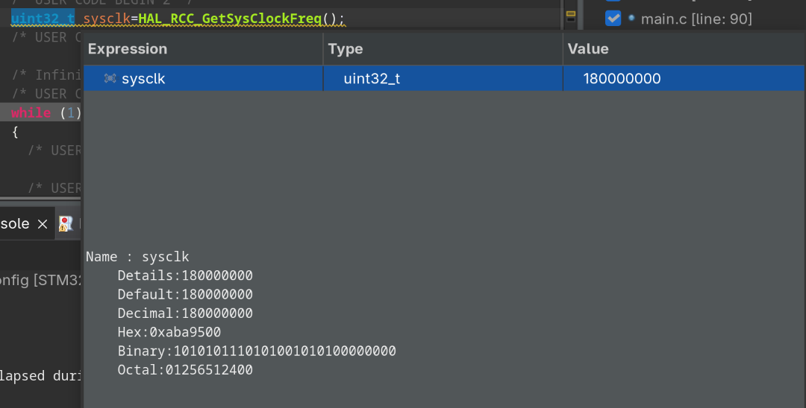
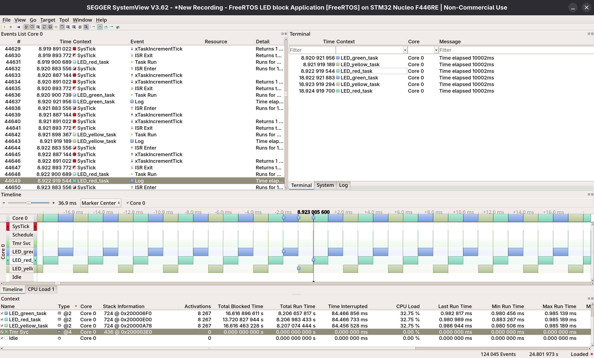

# STM32F446RE HSE Crystal (25MHz) Mod salvaged from Junk Electronics

Modifying a NUCLEO F446RE (MB1136 Rev C) to run from an external 25 MHz crystal salvaged from an early 2000s Broadcom router board, achieving a stable 180 MHz SYSCLK which is the maximum rated frequency of the STM32F446RE.


## Motivation

By default, the NUCLEO F446RE borrows an 8 MHz MCO signal from the onboard ST-Link chip as its HSE source. This introduces a hard dependency on the ST-Link being present. Populating the unpopulated X3 crystal circuit gives the MCU its own clean, independent clock source which is a requirement for USB, high-speed UART, and accurate SAI/I2S audio.


## Hardware

| Component | Source |
|---|---|
| 25 MHz Crystal (H25J7F) | Salvaged from Broadcom BCM6338 router board (circa 2005) |
| 20pF Load Capacitors x2 | Salvaged from same router board |
| NUCLEO F446RE (MB1136 Rev C) | Target board |


## Modifications

Reference schematic: MB1136 Rev C HSE oscillator circuit (X3, C33, C34, R35, R37, SB50, SB16, SB54, SB55)

| Ref | Action | Reason |
|---|---|---|
| SB50 | Removed (opened) | Disconnects MCO signal from OSC_IN of the nucleo |
| SB16 | Removed (opened) | Disconnects the F446RE's PA8/MCO pin from receiving the ST-Link clock |
| SB54 | Removed (opened) | Disconnects F446RE OSC_OUT pin from CN7 Morpho connector |
| SB55 | Removed (by default) | Disconnects F446RE OSC_IN pin from CN7 Morpho connector |
| R35 | Bridged with solder | Connects crystal to PF0/OSC_IN |
| R37 | Bridged with solder | Connects crystal to PF1/OSC_OUT |
| C33 | Populated 20pF | Load capacitor for crystal |
| C34 | Populated 20pF | Load capacitor for crystal |
| X3 | Populated 25 MHz crystal | HSE source |

> Note: R35/R37 were bridged with solder blobs as 0Ω resistors were unavailable. Electrically identical. A cleaner build would use proper 0Ω 0402 resistors.


## Schematic Reference




## Clock Configuration (180 MHz)

```
void SystemClock_Config(void)
{
  RCC_OscInitTypeDef RCC_OscInitStruct = {0};
  RCC_ClkInitTypeDef RCC_ClkInitStruct = {0};

  /** Configure the main internal regulator output voltage
  */
  __HAL_RCC_PWR_CLK_ENABLE();
  __HAL_PWR_VOLTAGESCALING_CONFIG(PWR_REGULATOR_VOLTAGE_SCALE1);

  /** Initializes the RCC Oscillators according to the specified parameters
  * in the RCC_OscInitTypeDef structure.
  */
  RCC_OscInitStruct.OscillatorType = RCC_OSCILLATORTYPE_HSE;
  RCC_OscInitStruct.HSEState = RCC_HSE_ON;
  RCC_OscInitStruct.PLL.PLLState = RCC_PLL_ON;
  RCC_OscInitStruct.PLL.PLLSource = RCC_PLLSOURCE_HSE;
  RCC_OscInitStruct.PLL.PLLM = 20;
  RCC_OscInitStruct.PLL.PLLN = 288;
  RCC_OscInitStruct.PLL.PLLP = RCC_PLLP_DIV2;
  RCC_OscInitStruct.PLL.PLLQ = 2;
  RCC_OscInitStruct.PLL.PLLR = 2;
  if (HAL_RCC_OscConfig(&RCC_OscInitStruct) != HAL_OK)
  {
    Error_Handler();
  }

  /** Activate the Over-Drive mode
  */
  if (HAL_PWREx_EnableOverDrive() != HAL_OK)
  {
    Error_Handler();
  }

  /** Initializes the CPU, AHB and APB buses clocks
  */
  RCC_ClkInitStruct.ClockType = RCC_CLOCKTYPE_HCLK|RCC_CLOCKTYPE_SYSCLK
                              |RCC_CLOCKTYPE_PCLK1|RCC_CLOCKTYPE_PCLK2;
  RCC_ClkInitStruct.SYSCLKSource = RCC_SYSCLKSOURCE_PLLRCLK;
  RCC_ClkInitStruct.AHBCLKDivider = RCC_SYSCLK_DIV1;
  RCC_ClkInitStruct.APB1CLKDivider = RCC_HCLK_DIV4;
  RCC_ClkInitStruct.APB2CLKDivider = RCC_HCLK_DIV2;

  if (HAL_RCC_ClockConfig(&RCC_ClkInitStruct, FLASH_LATENCY_5) != HAL_OK)
  {
    Error_Handler();
  }
}
```

**PLL Math:** 25 MHz ÷ 20 × 288 ÷ 2 = **180 MHz**


## Verification

### Donor Board (Broadcom Router)


### Nucleo Before Modification (X3 empty)
.jpg)

### Nucleo After Modification
.jpg)

### SB50 and SB54 Removed


### CubeMX Clock Tree (180 MHz)


### Debugger showing SYSCLK Confirmed 180 MHz


### SEGGER SystemView recording FreeRTOS at 180 MHz
- used HAL_GetTick and HAL_Delay to see the time elapsed in 10 seconds


---

## Results

| Metric | Value |
|---|---|
| HSE Source | 25 MHz crystal (H25J7F) |
| SYSCLK | 180 MHz |
| Timing Accuracy | 10002ms per 10000ms target (±0.02%) |
| RTOS | FreeRTOS with SEGGER SystemView |
| Clock Security | CSS enabled auto fallback to HSI on crystal failure |

---

## References

- [ST UM1724 STM32 Nucleo Board User Manual](https://www.st.com/resource/en/user_manual/um1724-stm32-nucleo64-boards-mb1136-stmicroelectronics.pdf)
- [STM32F446RE Datasheet](https://www.st.com/resource/en/datasheet/stm32f446re.pdf)
- [AN2867 Oscillator Design Guide for STM32](https://www.st.com/resource/en/application_note/an2867-guidelines-for-oscillator-design-on-stm8af-al-s-and-stm32-mcus-and-mpus-stmicroelectronics.pdf)
- [MB1136 Rev C Schematic](https://www.st.com/en/evaluation-tools/nucleo-f446re.html#cad-resources)
